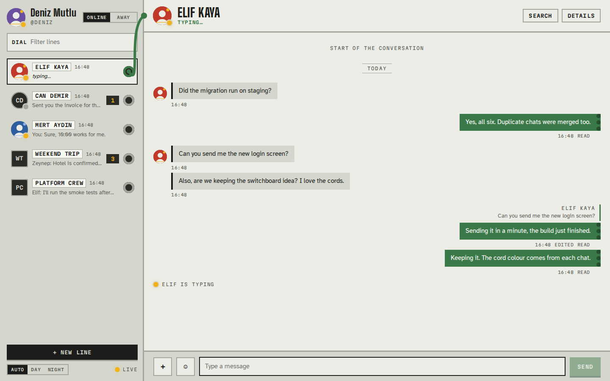
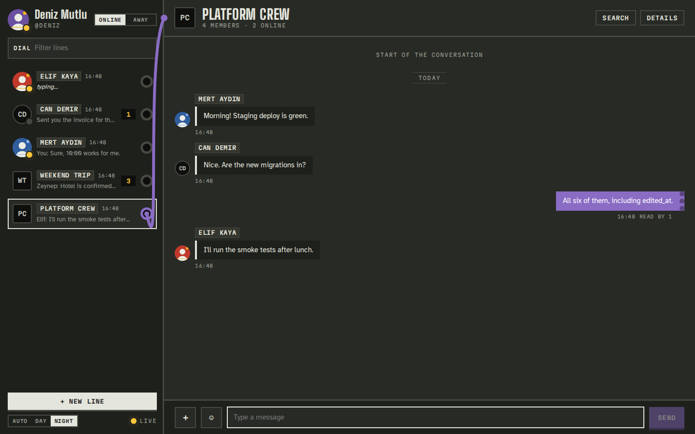
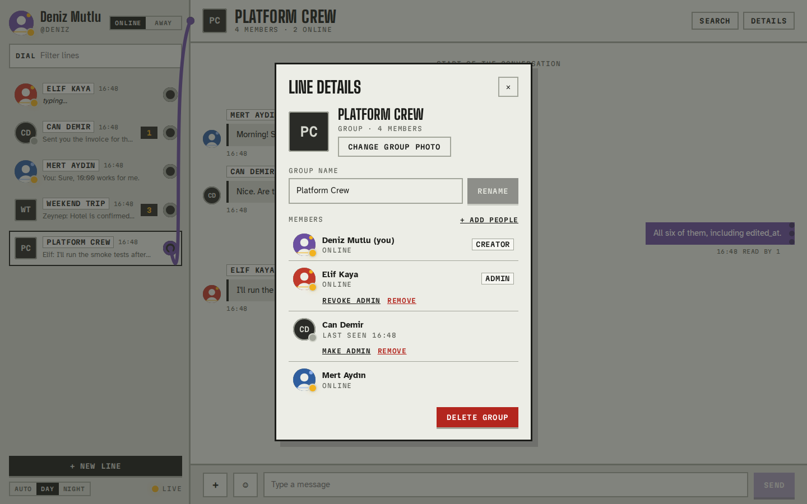
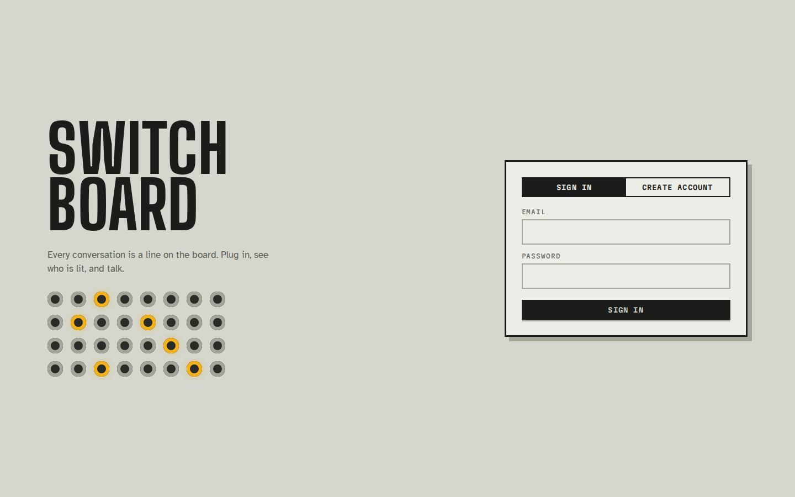
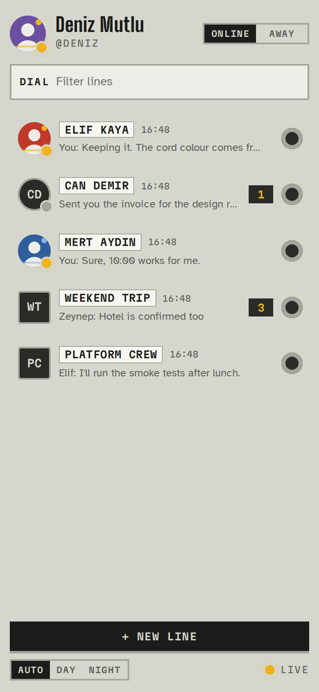
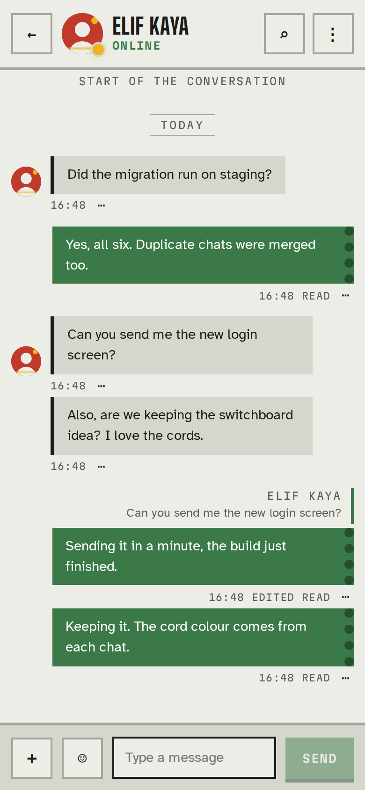

# Switchboard

[](https://github.com/deniz1976/Chat-App/actions/workflows/ci.yml)

**[English](#english) · [Türkçe](#turkce)**

A real-time chat application designed around an old telephone switchboard: every conversation is a jack on the board, a lamp shows who is online, and the open conversation is connected by a cord in the chat's own colour.



| Night theme | Group details |
| --- | --- |
|  |  |

| Sign in | Phone: board | Phone: conversation |
| --- | --- | --- |
|  |  |  |

---

<a id="english"></a>

## English

### Features

- **Direct and group chats.** A direct chat between two people is unique, even when both start it at the same time.
- **Real-time messaging** over WebSockets, delivered to every open tab and device.
- **Presence.** Online, away, typing and last seen, shared only with people you have a chat with.
- **Read receipts.** Shown as Sent, Read or Read by N, with unread counters and a New messages divider.
- **Message actions.** Reply with quotes, edit (marked as Edited) and delete for everyone.
- **Attachments.** Images, audio, video, PDF, ZIP and text files, stored in Cloudflare R2.
- **Search** inside a chat that jumps to the result, loading older history when needed.
- **Group management.** Rename, change the photo, add and remove members, and promote admins, all synced live to every member.
- **Profiles.** Profile photos, display names and an online/away switch.
- **Day and night themes** that follow the system setting, and a layout that works on phones.
- **Resilient client.** Messages are sent optimistically with retry, and the client reconnects and resynchronises automatically.

### Tech stack

| Area | Technology |
| --- | --- |
| Server | Node.js, Express 5, TypeScript, `ws` |
| Database | PostgreSQL with Sequelize, migrations with Umzug |
| Frontend | React 19, TypeScript, Vite |
| Storage | Cloudflare R2 through the AWS S3 SDK |
| Validation and security | Joi, Helmet, express-rate-limit, bcrypt, JWT in an httpOnly cookie |
| Quality | Jest and Supertest against PostgreSQL, ESLint, Prettier, GitHub Actions |

### Getting started

#### With Docker Compose

```bash
cp .env.example .env
# set at least DB_PASSWORD and JWT_SECRET (32+ characters) in .env
docker compose up --build
```

Compose starts PostgreSQL, applies the migrations and then starts the app on http://localhost:3000.

#### Local development

Requirements: Node.js 20.19 or later and PostgreSQL.

```bash
npm install
cp .env.example .env          # fill in the database settings and JWT_SECRET
npm run migrate:dev           # create or upgrade the schema
npm run dev                   # API and WebSocket server on http://localhost:3000
npm run dev:web               # frontend with hot reload on http://localhost:5173
```

For a production build, run `npm run build`, then `npm run migrate` and `npm start`. The server then also serves the frontend.

To make someone an administrator, run this once in the database:

```sql
UPDATE users SET role = 'admin' WHERE email = 'you@example.com';
```

### Configuration

All settings are read from environment variables. `.env.example` lists every variable.

| Variable | Description |
| --- | --- |
| `PORT` | HTTP port. Default: `3000` |
| `NODE_ENV` | `development` or `production`. In production the auth cookie is marked `Secure` |
| `LOG_LEVEL` | `error`, `warn`, `info`, `http` or `debug` |
| `CORS_ORIGINS` | Comma-separated extra origins allowed to call the API. Leave empty when the frontend is served by this server |
| `TRUST_PROXY` | Number of reverse proxies in front of the app, so rate limits use the client IP |
| `DB_HOST`, `DB_PORT`, `DB_USER`, `DB_PASSWORD`, `DB_NAME` | PostgreSQL connection |
| `DB_SSL`, `DB_SSL_CA_PATH`, `DB_SSL_REJECT_UNAUTHORIZED` | TLS for the database. The certificate is verified unless explicitly disabled |
| `JWT_SECRET` | Required, at least 32 characters |
| `JWT_EXPIRES_IN` | Session length, for example `1d` or `12h` |
| `CLOUDFLARE_ACCOUNT_ID`, `CLOUDFLARE_R2_BUCKET_NAME`, `CLOUDFLARE_R2_ACCESS_KEY_ID`, `CLOUDFLARE_R2_SECRET_ACCESS_KEY` | R2 bucket and an API token with read and write access |
| `CLOUDFLARE_R2_PUBLIC_HOSTNAME` | Public URL of the bucket, used for file links and allowed in the Content Security Policy |

The app runs without R2; only uploads are unavailable.

### Scripts

| Command | Description |
| --- | --- |
| `npm run dev` / `npm run dev:web` | Run the server and the frontend in development mode |
| `npm run build` | Build the server into `dist/` and the frontend into `web/dist/` |
| `npm start` | Start the built server |
| `npm run migrate` / `migrate:dev` | Apply pending migrations (built code / TypeScript sources) |
| `npm run migrate:undo` / `migrate:status` | Revert the last migration / list migrations |
| `npm test` | Run the test suite against PostgreSQL |
| `npm run lint` / `typecheck` / `format` | Lint, type-check and format |

### Project structure

```
src/
├── api/              HTTP controllers, routes, validators, middlewares and the WebSocket server
├── core/             Services with the business rules, typed errors and the realtime port
├── domain/           Sequelize models and repository interfaces
├── infrastructure/   Repositories, migrations, R2 storage and the WebSocket connection registry
├── container.ts      Wires repositories, services and the notifier together
└── server.ts         Entry point
web/src/
├── api/              Typed REST client
├── realtime/         Reconnecting WebSocket client
├── state/            Reducer and provider for chats, messages, presence and typing
└── components/       The board, the conversation and the dialogs
tests/                Integration tests
```

The API is documented with Swagger at `/api-docs`. The WebSocket endpoint is `/ws`. It is authenticated with the same cookie as the API and sends events for new, edited and deleted messages, read receipts, typing, presence and chat changes.

### Security

- The session token is kept in an httpOnly, SameSite=Strict cookie that scripts cannot read.
- Role-based authorization (user and admin), with ownership checks on every chat and message.
- WebSocket handshakes check both the cookie and the origin.
- Uploads are limited by type and size, and images are checked against their file signature.
- Rate limits apply to the API, to failed logins and to registrations. Logins take the same time whether or not the email exists.
- A strict Content Security Policy, and no sensitive data in the logs.

### Testing

The integration tests need a running PostgreSQL server. They create and drop the `chat_app_test` databases themselves.

```bash
DB_HOST=localhost DB_USER=postgres DB_PASSWORD=postgres npm test
```

### License

ISC

---

<a id="turkce"></a>

## Türkçe

Switchboard, eski bir telefon santralinden esinlenen gerçek zamanlı bir sohbet uygulaması. Her sohbet panelde bir jak; lambalar kimin çevrimiçi olduğunu gösteriyor, açık sohbet de o sohbete özgü renkteki bir kabloyla bağlanıyor.

### Özellikler

- **Birebir ve grup sohbetleri.** İki kişi arasındaki birebir sohbet tektir; iki taraf aynı anda başlatsa bile ikinci bir sohbet oluşmaz.
- **WebSocket ile anlık mesajlaşma.** Mesajlar açık olan her sekmeye ve cihaza iletilir.
- **Çevrimiçi durumu.** Çevrimiçi, uzakta, yazıyor ve son görülme bilgileri yalnızca ortak sohbeti olan kişilerle paylaşılır.
- **Okundu bilgisi.** Mesajlarda Sent, Read ya da Read by N görünür; okunmamış sayacı ve "New messages" ayırıcısı vardır.
- **Mesaj işlemleri.** Alıntılı yanıt, düzenleme ("Edited" etiketiyle) ve herkesten silme.
- **Dosya ekleri.** Resim, ses, video, PDF, ZIP ve metin dosyaları Cloudflare R2'de saklanır.
- **Sohbet içinde arama.** Sonuca tıklayınca ilgili mesaja gidilir; mesaj henüz yüklenmemişse eski geçmiş otomatik olarak yüklenir.
- **Grup yönetimi.** Yeniden adlandırma, grup fotoğrafı, üye ekleme ve çıkarma, admin yapma. Değişiklikler tüm üyelere anında yansır.
- **Profil.** Profil fotoğrafı, görünen ad ve çevrimiçi/uzakta anahtarı.
- **Gündüz ve gece teması.** Sistem ayarını takip eder; arayüz telefonda da çalışır.
- **Dayanıklı istemci.** Mesajlar iyimser olarak gönderilir ve başarısız olursa tekrar denenebilir. Bağlantı koparsa istemci kendiliğinden yeniden bağlanır ve aradaki mesajları getirir.

### Teknolojiler

| Alan | Teknoloji |
| --- | --- |
| Sunucu | Node.js, Express 5, TypeScript, `ws` |
| Veritabanı | PostgreSQL, Sequelize, Umzug ile migration'lar |
| Arayüz | React 19, TypeScript, Vite |
| Depolama | AWS S3 SDK üzerinden Cloudflare R2 |
| Doğrulama ve güvenlik | Joi, Helmet, express-rate-limit, bcrypt, httpOnly cookie'de JWT |
| Kalite | PostgreSQL'e karşı Jest ve Supertest, ESLint, Prettier, GitHub Actions |

### Kurulum

#### Docker Compose ile

```bash
cp .env.example .env
# .env içinde en az DB_PASSWORD ve JWT_SECRET (en az 32 karakter) değerlerini ayarlayın
docker compose up --build
```

Compose önce PostgreSQL'i başlatır, migration'ları uygular ve ardından uygulamayı http://localhost:3000 adresinde çalıştırır.

#### Yerel geliştirme

Gereksinimler: Node.js 20.19 veya üstü ve PostgreSQL.

```bash
npm install
cp .env.example .env          # veritabanı ayarlarını ve JWT_SECRET'ı doldurun
npm run migrate:dev           # şemayı oluşturur veya günceller
npm run dev                   # API ve WebSocket sunucusu: http://localhost:3000
npm run dev:web               # otomatik yenilenen arayüz: http://localhost:5173
```

Production için `npm run build`, ardından `npm run migrate` ve `npm start` çalıştırın. Bu modda arayüzü de sunucu sunar.

Bir kullanıcıyı admin yapmak için veritabanında bir kez şunu çalıştırın:

```sql
UPDATE users SET role = 'admin' WHERE email = 'siz@ornek.com';
```

### Yapılandırma

Tüm ayarlar ortam değişkenlerinden okunur. Değişkenlerin tamamı `.env.example` dosyasında listelenmiştir.

| Değişken | Açıklama |
| --- | --- |
| `PORT` | HTTP portu. Varsayılan: `3000` |
| `NODE_ENV` | `development` ya da `production`. Production'da oturum cookie'si `Secure` olarak işaretlenir |
| `LOG_LEVEL` | `error`, `warn`, `info`, `http` ya da `debug` |
| `CORS_ORIGINS` | API'ye erişebilecek ek origin'ler, virgülle ayrılır. Arayüz bu sunucudan sunuluyorsa boş bırakın |
| `TRUST_PROXY` | Uygulamanın önündeki reverse proxy sayısı; rate limit'in gerçek istemci IP'sini kullanması için gerekir |
| `DB_HOST`, `DB_PORT`, `DB_USER`, `DB_PASSWORD`, `DB_NAME` | PostgreSQL bağlantısı |
| `DB_SSL`, `DB_SSL_CA_PATH`, `DB_SSL_REJECT_UNAUTHORIZED` | Veritabanı için TLS. Açıkça kapatılmadıkça sertifika doğrulanır |
| `JWT_SECRET` | Zorunlu, en az 32 karakter |
| `JWT_EXPIRES_IN` | Oturum süresi, örneğin `1d` ya da `12h` |
| `CLOUDFLARE_ACCOUNT_ID`, `CLOUDFLARE_R2_BUCKET_NAME`, `CLOUDFLARE_R2_ACCESS_KEY_ID`, `CLOUDFLARE_R2_SECRET_ACCESS_KEY` | R2 bucket'ı ve okuma/yazma yetkili API anahtarı |
| `CLOUDFLARE_R2_PUBLIC_HOSTNAME` | Bucket'ın herkese açık adresi. Dosya bağlantılarında kullanılır ve içerik güvenlik politikasında (CSP) izinlidir |

Uygulama R2 olmadan da çalışır; bu durumda sadece dosya yükleme devre dışı kalır.

### Komutlar

| Komut | Açıklama |
| --- | --- |
| `npm run dev` / `npm run dev:web` | Sunucuyu ve arayüzü geliştirme modunda çalıştırır |
| `npm run build` | Sunucuyu `dist/`, arayüzü `web/dist/` klasörüne derler |
| `npm start` | Derlenmiş sunucuyu başlatır |
| `npm run migrate` / `migrate:dev` | Bekleyen migration'ları uygular (derlenmiş koddan / TypeScript kaynaklarından) |
| `npm run migrate:undo` / `migrate:status` | Son migration'ı geri alır / migration'ları listeler |
| `npm test` | Testleri PostgreSQL'e karşı çalıştırır |
| `npm run lint` / `typecheck` / `format` | Lint, tip kontrolü ve biçimlendirme |

### Proje yapısı

```
src/
├── api/              HTTP controller'ları, route'lar, doğrulayıcılar, middleware'ler ve WebSocket sunucusu
├── core/             İş kurallarını içeren servisler, tipli hatalar ve realtime arayüzü
├── domain/           Sequelize modelleri ve repository arayüzleri
├── infrastructure/   Repository'ler, migration'lar, R2 depolama ve WebSocket bağlantı kaydı
├── container.ts      Repository'leri, servisleri ve bildirim katmanını birbirine bağlar
└── server.ts         Giriş noktası
web/src/
├── api/              Tipli REST istemcisi
├── realtime/         Otomatik yeniden bağlanan WebSocket istemcisi
├── state/            Sohbetler, mesajlar, çevrimiçi durumu ve "yazıyor" bilgisi için reducer ve provider
└── components/       Pano, sohbet ekranı ve pencereler
tests/                Entegrasyon testleri
```

API dokümantasyonu `/api-docs` adresinde Swagger ile sunulur. WebSocket uç noktası `/ws`'dir. API ile aynı cookie üzerinden kimlik doğrular; yeni, düzenlenen ve silinen mesajlar, okundu bilgisi, yazıyor bilgisi, çevrimiçi durumu ve sohbet değişiklikleri için olay gönderir.

### Güvenlik

- Oturum token'ı, JavaScript'in okuyamadığı httpOnly ve SameSite=Strict bir cookie'de tutulur.
- Rol tabanlı yetkilendirme (user ve admin) vardır; her sohbet ve mesaj işleminde sahiplik kontrol edilir.
- WebSocket bağlantısı hem cookie hem de origin doğrulamasından geçer.
- Dosya yüklemeleri tür ve boyutla sınırlıdır; resimler dosya imzasına göre doğrulanır.
- API'ye, başarısız giriş denemelerine ve kayıtlara rate limit uygulanır. Login yanıtı, e-posta kayıtlı olsun ya da olmasın aynı sürede döner.
- Sıkı bir içerik güvenlik politikası (CSP) uygulanır ve loglarda hassas veri tutulmaz.

### Testler

Entegrasyon testleri çalışan bir PostgreSQL sunucusu ister. `chat_app_test` veritabanlarını testler kendileri oluşturup siler.

```bash
DB_HOST=localhost DB_USER=postgres DB_PASSWORD=postgres npm test
```

### Lisans

ISC
