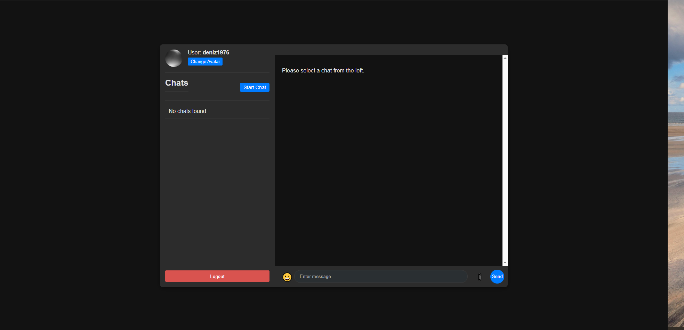

# Real-time Chat Application

An advanced real-time chat application built with Node.js, TypeScript, WebSockets, PostgreSQL, and integrated with Cloudflare R2 for media storage. This project emphasizes clean architecture and domain-driven design principles.



## Features

*   **Real-time Messaging:** Utilizes WebSockets (`ws` library) for instant message delivery between connected clients.
*   **User Authentication & Authorization:** Secure user login and session management using JSON Web Tokens (JWT) stored in an httpOnly, SameSite=Strict cookie. WebSocket connections are authenticated with the same cookie.
*   **User Avatars:** Allows users to upload and update their profile pictures, stored in Cloudflare R2.
*   **Direct & Group Chats:** Supports both one-on-one conversations and multi-user group chats.
*   **Image Sharing:** Allows users to share images within chats, stored in Cloudflare R2.
*   **Message Status:** Indicates whether messages are `sent`, `delivered`, or `read` (Real-time updates via WebSockets for read receipts).
*   **Typing Indicators:** Shows when a user is actively typing in a chat session via WebSocket updates.
*   **Online/Offline Status:** Tracks and broadcasts user presence status (online/offline) to relevant clients in real-time.
*   **Media Storage:** Integrated with Cloudflare R2 for scalable and efficient object storage (avatars, chat images).
*   **API Documentation:** Provides API documentation via Swagger UI.
*   **Robust Error Handling:** Centralized error handling mechanism.
*   **Structured Logging:** Comprehensive logging using Winston.
*   **Security:** Implements security best practices including Helmet for headers, CORS configuration, rate limiting, and input validation.

## Tech Stack

*   **Backend:** Node.js, Express.js (for routing and middleware), TypeScript.
*   **Database:** PostgreSQL (a powerful open-source relational database).
*   **ORM:** Sequelize (provides an abstraction layer for interacting with the PostgreSQL database).
*   **Real-time Communication:** WebSockets (`ws` library for raw WebSocket implementation).
*   **Authentication:** JSON Web Tokens (JWT) (`jsonwebtoken` library).
*   **File Upload Handling:** Multer (`multer`) for processing multipart/form-data requests.
*   **Media Storage & Delivery:** Cloudflare R2 (Object storage service) integrated via AWS SDK v3 (`@aws-sdk/client-s3`). Configuration includes R2 Bucket Name, Public Hostname, Access Key ID, Secret Access Key.
*   **Validation:** Joi (for robust request data validation).
*   **Logging:** Winston (a versatile logging library for Node.js, configured for console and file output).
*   **Security:** Helmet (helps secure Express apps by setting various HTTP headers), CORS (enables Cross-Origin Resource Sharing), express-rate-limit (basic rate limiting to prevent abuse).
*   **Containerization:** Docker (Dockerfile provided for building container images).

## Project Structure

The project follows a layered architecture: controllers and WebSocket handlers only translate transport concerns, services in `core` hold business rules and depend on repository interfaces from `domain`, and `infrastructure` provides the Sequelize and WebSocket implementations. Dependencies are wired in `src/container.ts`.

```
src/
├── api/                  # Transport layer: HTTP and WebSocket adapters.
│   ├── controllers/      # Thin request handlers that delegate to services.
│   ├── middlewares/      # Authentication, rate limiting, uploads and error handling.
│   ├── presenters/       # Response shaping (e.g., public vs. private user fields).
│   ├── routes/           # Endpoint definitions.
│   ├── validators/       # Joi schemas for bodies, queries and route parameters.
│   └── websocket/        # WebSocket server: handshake authentication and event dispatch.
├── config/               # Configuration loaded from environment variables.
├── core/                 # Application layer.
│   ├── services/         # Business rules and authorization (auth, users, chats, messages, presence).
│   ├── errors.ts         # Typed errors mapped to HTTP status codes.
│   └── realtime.ts       # Realtime event types and the notifier port used by services.
├── domain/               # Domain layer.
│   ├── entities/         # User, Chat and Message models.
│   └── repositories/     # Repository interfaces.
├── infrastructure/       # Infrastructure layer.
│   ├── database/         # Sequelize setup and associations.
│   ├── realtime/         # WebSocket connection registry implementing the notifier port.
│   └── repositories/     # Sequelize implementations of the repository interfaces.
├── utils/                # Logger and helpers.
├── container.ts          # Composition root wiring repositories, services and the notifier.
└── server.ts             # Application entry point.
public/                   # Static frontend files (HTML, CSS, JavaScript).
```

## Getting Started

### Prerequisites

*   Node.js (v18 or higher)
*   npm (usually comes with Node.js)
*   PostgreSQL Server
*   Cloudflare Account (for R2 object storage)
    *   Cloudflare Account ID
    *   R2 Bucket created
    *   R2 API Token with **Read & Write** permissions (generates Access Key ID and Secret Access Key)
    *   (Optional but Recommended) Public Hostname configured for the R2 bucket for direct image access.
*   Docker (Optional, for running in a container)

### Installation

1.  **Clone the repository:**
    ```bash
    git clone https://github.com/deniz1976/Chat-App.git
    cd Chat-App
    ```

2.  **Install backend dependencies:**
    ```bash
    npm install
    ```

3.  **Set up Environment Variables:**
    Create a `.env` file in the root directory (`Chat-App/.env`). Use the following structure and fill in your details:

    ```dotenv
    # Server Configuration
    PORT=3000
    NODE_ENV=development # or production
    CORS_ORIGINS= # Comma-separated list of additional allowed origins. Leave empty when the frontend is served by this server
    TRUST_PROXY=false # Set to the number of reverse proxies in front of the app (e.g., 1) so rate limiting uses the client IP

    # Database Configuration (PostgreSQL)
    DB_DIALECT=postgres
    DB_HOST=localhost
    DB_PORT=5432
    DB_USER=your_db_user
    DB_PASSWORD=your_db_password
    DB_NAME=chat_app
    DB_SSL=false # Set to true if using SSL connection

    # JWT Authentication
    JWT_SECRET=generate_a_very_strong_random_secret_key # Required, at least 32 characters. The server refuses to start without it.
    JWT_EXPIRES_IN=1d # e.g., 1d, 12h, 60m

    # Cloudflare R2 Configuration
    CLOUDFLARE_ACCOUNT_ID=your_cloudflare_account_id
    CLOUDFLARE_R2_BUCKET_NAME=your_r2_bucket_name
    # Ensure this is the hostname for PUBLIC access (e.g., from Cloudflare R2 settings)
    # Example: https://pub-yourhash.r2.dev OR your custom domain mapped to the bucket
    CLOUDFLARE_R2_PUBLIC_HOSTNAME=your_r2_public_url_including_https
    # Credentials from an R2 API Token with Read & Write permissions
    CLOUDFLARE_R2_ACCESS_KEY_ID=your_r2_access_key_id
    CLOUDFLARE_R2_SECRET_ACCESS_KEY=your_r2_secret_access_key
    ```
    *   **Important:** Ensure the R2 API Token used for the Access Key ID and Secret Access Key has **Read & Write** permissions for your bucket.*
    *   **Important:** `CLOUDFLARE_R2_PUBLIC_HOSTNAME` should be the **full URL prefix** used to access your bucket publicly (including `https://`).*
    *   **Never commit your `.env` file to Git.**

4.  **Create the database:**
    Ensure your PostgreSQL server is running. Connect and run:
    ```sql
    CREATE DATABASE chat_app;
    ```

5.  **Run database migrations:**
    ```bash
    npm run migration:run
    ```

### Running the Application

*   **Development Mode (with Backend Auto-Restart):**
    ```bash
    npm run dev
    ```
    The backend server will start (typically on `http://localhost:3000`). The frontend is available by opening the `public/index.html` file in your browser (or serving it via a simple HTTP server).

*   **Production Mode:**
    Build the TypeScript code:
    ```bash
    npm run build
    ```
    Start the application:
    ```bash
    npm start
    ```

### Accessing the Frontend

Simply open the `public/index.html` file directly in your web browser. The JavaScript code will connect to the backend server running on `localhost:3000` (or the configured port).

## Key Features Implementation

*   **Avatar Upload:**
    *   Frontend (`public/script.js`): Sends the image file via a PUT request to `/api/v1/users/profile/avatar`.
    *   Backend (`src/api/middlewares/upload.ts`): Buffers the file in memory with `multer`, enforcing the allowed MIME types and size limit of the upload kind.
    *   Backend (`src/core/services/UploadService.ts`): Verifies that images match their declared type by their file signature, stores the file in R2 under a generated key and returns its public URL. Uploads of generic files are stored with `Content-Disposition: attachment`.
    *   Backend (`src/core/services/UserService.ts` -> `changeAvatar`): Updates the user's `profileImage` with the stored file URL.
*   **Avatar Display:**
    *   Frontend (`public/script.js`): Uses the `profileImage` URL (fetched from the API) directly in `` tag `src` attributes.
    *   R2 Configuration: Requires the R2 bucket to allow public read access via the configured `CLOUDFLARE_R2_PUBLIC_HOSTNAME`.

## API Documentation

Available at `/api-docs` when the server is running (e.g., `http://localhost:3000/api-docs`).

## WebSocket Protocol

The application uses WebSockets for real-time features.

### Connection

*   Clients connect to the WebSocket server on the same host as the HTTP server (e.g., `ws://localhost:3000`).
*   **Authentication:** The handshake is authenticated with the `access_token` httpOnly cookie set by the login and register endpoints. Browsers send it automatically on same-origin connections.
*   **Origin Check:** The handshake is rejected unless the `Origin` header matches the server host, preventing cross-site WebSocket hijacking.
*   **Keep-Alive:** The server uses a ping/pong mechanism every 30 seconds to detect and terminate stale connections. Clients should respond to pings with pongs to maintain the connection.

### Message Structure

Messages exchanged over WebSockets generally follow this JSON structure:

```json
{
  "type": "MESSAGE_TYPE_ENUM",
  "payload": { ... } // Data specific to the message type
}
```

### Message Types (`WebSocketMessageType`)

The following message types are handled by the server (sent from client or broadcasted by server):

*   `NEW_MESSAGE`: Broadcasted by the server when a new chat message is created. Payload contains message details.
*   `TYPING`: Sent by the client to indicate typing status. Broadcasted to other chat participants.
    *   Payload: `{ chatId: string, isTyping: boolean, participantIds: string[] }`
*   `READ_RECEIPT`: Sent by the client when they read messages. Broadcasted to relevant participants.
    *   Payload: `{ chatId: string, messageId: string, participantIds: string[] }`
*   `USER_STATUS`: Broadcasted by the server when a user's connection status changes (online/offline).
    *   Payload: `{ userId: string, status: 'online' | 'offline', timestamp: string }`
*   `CHAT_CREATED`: Potentially broadcasted when a new chat is created (verify specific implementation).
*   `ERROR`: Sent by the server to a specific client if an error occurs processing their message (e.g., invalid format).
    *   Payload: `{ message: string }`

## Configuration

Application configuration is managed via environment variables, loaded using the `dotenv` library.

*   The primary configuration file is `src/config/index.ts`, which reads `process.env` variables and provides a typed `config` object used throughout the application.
*   A `.env` file in the project root is used to store sensitive information and environment-specific settings during development. **Do not commit the `.env` file to version control.** Use a `.env.example` file to document required variables.

## Logging

*   Logging is implemented using the **Winston** library (`src/utils/logger.ts`).
*   **Transports:** Logs are output to:
    *   The console (with colors and timestamps, level based on `NODE_ENV`).
    *   `logs/error.log`: Only errors are logged here.
    *   `logs/combined.log`: All logs (based on the configured level) are logged here.
*   **Levels:** Standard log levels (error, warn, info, http, debug) are used. The logging level is set to `debug` in development and `info` in production.
*   **Format:** Console logs are formatted for readability, while file logs are stored in JSON format.

## Error Handling

*   Services throw typed errors from `src/core/errors.ts` (`BadRequestError`, `ForbiddenError`, `NotFoundError`, `ConflictError`, ...), which the global handler in `src/api/middlewares/errorHandler.ts` maps to the matching status code and message.
*   Express 5 forwards rejected promises from async route handlers to the error handler, so controllers do not need their own try/catch blocks.
*   Unexpected errors are logged with their stack trace and answered with a generic `500` response. In **development** the response also includes the error message and stack trace.
*   Malformed JSON bodies and invalid route parameters are answered with `400`, and unknown routes with `404`.

## Security

Several security measures are implemented:

*   **Helmet:** Sets various HTTP headers to protect against common web vulnerabilities (e.g., XSS, clickjacking).
*   **CORS:** Disabled by default because the frontend is served from the same origin. Additional origins can be allowed through `CORS_ORIGINS`, which also applies to WebSocket handshakes.
*   **JWT Authentication:** The token is delivered in an httpOnly, SameSite=Strict cookie (`Secure` in production), so it is not readable from JavaScript and is not sent on cross-site requests. It secures both API endpoints and WebSocket connections.
*   **Role-Based Authorization:** Users have a `role` of `user` (default) or `admin`. A user can update or delete only their own account; admins can manage any account and change roles through `PUT /api/v1/users/:id/role`. The first admin must be promoted directly in the database:
    ```sql
    UPDATE users SET role = 'admin' WHERE email = 'you@example.com';
    ```
*   **Rate Limiting:** Uses `express-rate-limit` per client IP: API requests are limited to 1000 per 15 minutes, failed logins to 10 per 15 minutes and registrations to 5 per hour. Static files are not rate limited. Set `TRUST_PROXY` when running behind a reverse proxy.
*   **Input Validation:** Uses `Joi` to validate incoming request data (body, query, params) against predefined schemas, preventing invalid or malicious data from being processed.
*   **Environment Variables:** Sensitive information like API keys and database credentials are stored securely in environment variables, not hardcoded in the source code.

## Docker Support

*   A `dockerfile` is included in the root directory, allowing you to build a Docker image for the application.
*   A `.dockerignore` file specifies files and directories to exclude from the image build context, optimizing the image size.
*   To build the image: `docker build -t chat-app .`
*   To run the container (ensure required environment variables are passed, e.g., via `-e` flags or a `.env` file): `docker run -p 3000:3000 --env-file .env chat-app` (adjust port mapping and env file as needed).
